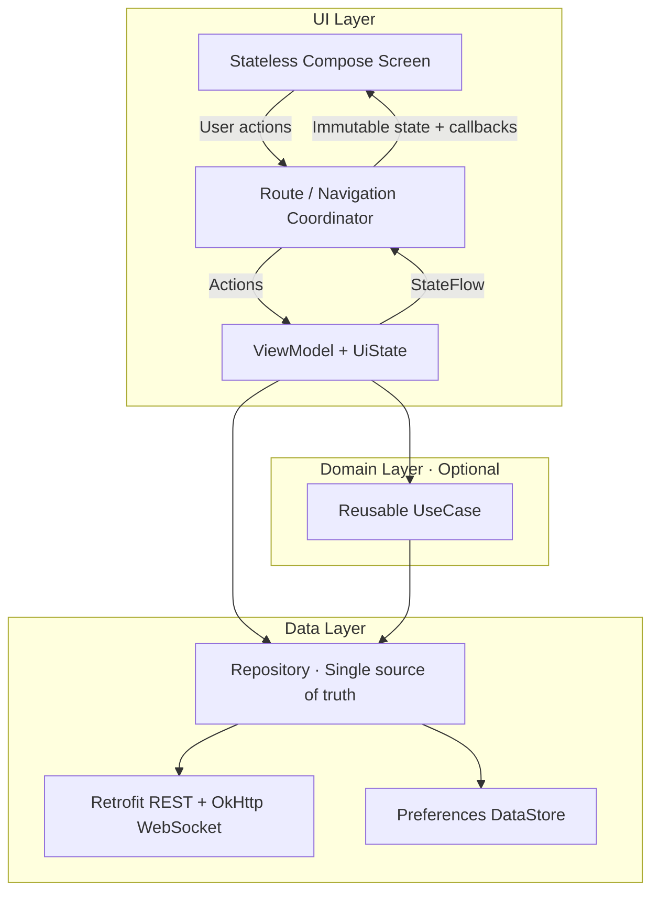

<div align="center">


# XinChat

基于 Kotlin 和 Jetpack Compose 的通讯程序

<div align="center">
    <a href="README_EN.md">🌍 English</a>
</div>


使用 Kotlin、Jetpack Compose 与 MVVM，从零实践可演进、可测试的现代 Android 应用架构。

[](https://kotlinlang.org/)
[](https://developer.android.com/compose)
[](#架构设计)
[](https://developer.android.com/)

[项目介绍](#项目介绍) · [快速开始](#快速开始) · [架构设计](#架构设计) · [学习路线](#学习路线) · [参与贡献](#参与贡献)

</div>

> [!IMPORTANT]
> XinChat 是用于学习 Jetpack Compose 与 MVVM 的开发中项目，不是可直接投入生产的即时通讯产品。仓库会保留架构演进过程，让学习者能够理解每项设计的动机、实现和取舍。

## 项目介绍

XinChat 以现代通讯应用为业务载体，计划覆盖账号认证、会话列表、单聊/群聊、联系人、消息同步、搜索、通知和个性化设置等典型场景。项目的重点不是复刻 Telegram，而是通过足够真实的业务复杂度演示：

- 如何用 Jetpack Compose 构建状态驱动、可预览、可测试的 UI。
- 如何使用 MVVM 与单向数据流组织屏幕状态和用户事件。
- 如何在多模块工程中划分 App、Core、Feature 与 Build Logic 的职责。
- 如何使用 Repository、Flow、网络和本地数据库建立单一事实来源。
- 如何用 Hilt、Fake、单元测试和 Compose UI Test 提升可维护性。
- 如何把 Debug、Lint、R8、Release 和依赖管理纳入日常工程流程。

架构思想参考 Google 的开源示例 [Now in Android](https://github.com/android/nowinandroid)，并遵循 [Android 官方架构建议](https://developer.android.com/topic/architecture/recommendations)。XinChat 会结合即时通讯业务重新实现相关模式，而不是复制 Now in Android 的业务代码。

## 架构设计

XinChat 采用分层架构、MVVM 和单向数据流。高层响应低层数据变化，用户事件向下传递，数据通过 Kotlin Flow 向上暴露。



Domain 层是可选的：只有业务规则被多个 ViewModel 复用，或单个 ViewModel 的业务编排明显复杂时才引入 UseCase。

### UI 层

- `Route` 获取屏幕级 ViewModel、生命周期感知地收集 StateFlow，并协调导航。
- `Screen` 是无状态 Composable，只接收不可变 UiState 和事件回调。
- ViewModel 使用 `viewModelScope` 处理业务动作，不持有 Activity、Context、Composable 或导航返回栈。
- UI 遵循状态向下、事件向上的 UDF，使用 Material 3 和项目设计系统。

### 数据层

- ViewModel 不直接访问 Retrofit Service、Room DAO 或其他具体数据源。
- Repository 是数据层对外入口，并负责数据同步和单一事实来源。
- DTO、数据库 Entity、领域模型和 UI 模型按职责映射，避免跨层泄漏实现细节。
- 一次性操作使用 `suspend`，持续数据使用 `Flow`。

### 模块边界

```text
XinChat
├── app/                         # Activity、应用主题、导航宿主、Feature 装配
├── build-logic/convention/      # Gradle Convention Plugin
├── core/
│   ├── designsystem/            # Material 3 主题与设计 token
│   ├── data/                    # API、WebSocket、会话与 Repository
│   ├── navigation/              # Navigation 3 公共契约
│   └── ui/                      # 跨 Feature 复用的无业务 UI
└── feature/
    ├── auth/                    # 认证业务
    ├── chat/                    # 会话与消息业务
    ├── contact/                 # 好友与申请业务
    └── user/                    # 用户与个人资料业务
```

模块依赖遵循以下规则：

- `app` 可以依赖 Feature 和 Core，并负责最终装配。
- Feature 可以依赖 Core，但不能直接依赖其他 Feature 的内部实现。
- Core 不依赖 Feature 或 App。
- 跨 Feature 跳转通过公开的类型安全导航契约完成。
- 共享代码只有在出现两个以上真实消费者后才提升到 Core。

## 技术栈

| 分类 | 技术 | 使用方式 |
| --- | --- | --- |
| 语言 | Kotlin | 业务、构建逻辑与测试 |
| UI | Jetpack Compose、Material 3 | 声明式 UI、主题、Preview |
| 架构 | MVVM、UDF | ViewModel + StateFlow + 无状态 Screen |
| 异步 | Kotlin Coroutines、Flow | 跨层异步与响应式数据流 |
| 导航 | Navigation 3 | 类型安全 NavKey、三个顶级返回栈与聊天详情栈 |
| 依赖注入 | Hilt、KSP | 构造函数注入和编译期代码生成 |
| 网络 | Retrofit、OkHttp、Kotlin Serialization | REST 写入、WebSocket 实时事件与错误映射 |
| 本地会话 | Preferences DataStore | 保存登录会话；访问令牌不参与系统备份 |
| 后端 | Spring Boot、JPA、MySQL、WebSocket | 注册、好友、单聊与实时事件 |
| 构建 | Gradle Kotlin DSL、Version Catalog | 依赖、插件和版本集中管理 |
| 构建复用 | Convention Plugin | 统一 Android、Compose 与 Hilt 配置 |
| 测试 | JUnit、Compose UI Test、AndroidX Test | 单元、UI 与设备测试 |
| 质量 | Android Lint、R8、Resource Shrinking | 静态检查与发布优化 |

实际版本以 [gradle/libs.versions.toml](gradle/libs.versions.toml) 为准。

## 快速开始

### 环境要求

- Android Studio 最新稳定版
- JDK 17
- Android SDK 37
- Git
- 支持 API 24+ 的模拟器或 Android 设备

### 获取项目

```bash
git clone https://github.com/Akiha678/XinChat.git
cd XinChat
```

## 开发规范

- 提交前至少运行受影响测试、`assembleDevDebug` 和 `git diff --check`。
- 新增依赖统一写入 Version Catalog；通用 Gradle 配置优先写入 Convention Plugin。
- 业务 Screen 保持无状态，ViewModel 暴露不可变 StateFlow，数据访问经过 Repository。
- 源码注释和 KDoc 默认使用中文，只解释业务约束与设计原因，不复述代码。
- 用户可见文案进入 string resources；输入必须在客户端和服务端同时校验。
- 不提交 Token、签名文件、密码、私有服务器地址或其他敏感信息。

## 参与贡献

欢迎通过 [Issues](https://github.com/Akiha678/XinChat/issues) 提交 Bug、教学建议和功能提案。

建议的贡献流程：

1. Fork 仓库并从最新主分支创建功能分支。
2. 在单一范围内完成修改并补充必要测试。
3. 运行相关测试、Debug 构建、Lint 和差异检查。
4. 提交 Pull Request，说明影响模块、设计取舍、验证命令和 UI 截图。

较大的架构调整建议先创建 Issue 讨论，避免实现方向与项目教学目标不一致。

## 参考与致谢

- [Now in Android](https://github.com/android/nowinandroid)：架构、模块化、测试和现代 Android 工程实践参考。
- [Guide to app architecture](https://developer.android.com/topic/architecture)：Android 官方分层架构与 UDF 指南。
- [Jetpack Compose](https://developer.android.com/compose)：声明式 UI、状态、工具和测试文档。
- [Material 3](https://m3.material.io/)：设计系统与自适应界面规范。

XinChat 是独立的非官方教学项目，与 Google、Telegram 及其关联公司不存在隶属、授权或背书关系。相关名称和商标归各自权利人所有。
